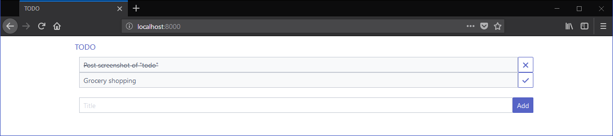

# todo 📝
[](https://godoc.org/github.com/prologic/todo)
[](https://goreportcard.com/report/github.com/prologic/todo)
[](https://microbadger.com/images/prologic/todo)
[](https://microbadger.com/images/prologic/todo)

todo is a self-hosted todo web app that lets you keep track of your todos
in a easy and minimal way.

## Demo



There is also a public demo instance avilable at: https://todo.mills.io/

## Installation

### Source

```#!bash
$ go get github.com/prologic/todo
```

## Usage

Run todo:

```#!bash
$ todo
```

Then visit: http://localhost:8000/

## Configuration

By default todo stores todos in `todo.db` in the local directory. This can
be configured with the `-dbpath /path/to/todo.db` option.

## License

MIT
